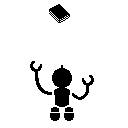
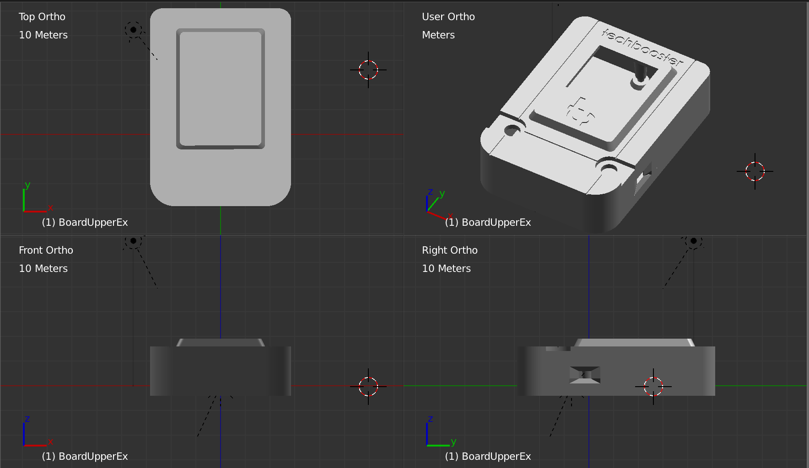

# C91 GameKit 

TechBooster's original hardware  (Arduino Compatible / Pro mini ATMEGA 328T 3.3V/8MHz)

C91で頒布したArduino互換ゲームキットのリポジトリです

## サンプルゲーム



## ディレクトリ構造

 * c91-gamekit-hardware-design 基板各種DXFデータ
 * c91-gamekit-software プリインストールソフトウェア「落とさない新刊」サンプルソースコード

## 開発環境

 * __Writing環境は3.3V__
 * __破損の可能性：GameKit付属の液晶を外し、電池からの給電がOFFであることを確認して接続すること__
 * ハードウェア
   * SeeedStudio Arduino Pro Mini 3.3V/8MHz
   * 1.44" SPI LCD
   * FT232RLボード(書き込み用) 
 * ソフトウェア
 * Visual Studio 2015 Professional(Communityでも可、Express不可)
   * [VisualMicro](https://marketplace.visualstudio.com/items?itemName=VisualMicro.ArduinoIDEforVisualStudio)拡張が必須
 * Arduino IDEは1.6.12で動作確認済み

## タイトル画面ほか画像データ(xbm_*.h)のビルド方法（自分で画像を変更するときに必要な手順）

１. artworkディレクトリ以下にPNGフォーマットで処理対象ファイルを格納

２. artwork/dimension.csv ファイルにファイル名(.pngを除く)と寸法を記入(ほかのファイルの記述に倣う)

３. ImageMagickを導入したMac上(Bash on Windowsでも可)で次のコマンドを実行

```
$ ./generate_artwork_headers.sh
```

次のように実行結果が出力されれば成功。

```
INFO: Input image "body.png" need to be 20 x 42
INFO: Successfully written xbm_body.h
INFO: Input image "hand-left-1.png" need to be 22 x 25
INFO: Successfully written xbm_hand_left_1.h
INFO: Input image "hand-left-2.png" need to be 22 x 34
INFO: Successfully written xbm_hand_left_2.h
...
INFO: Input image "title.png" need to be 64 x 64
INFO: Successfully written xbm_title.h
```

４. Arduino IDEやVisual Studio上でプロジェクトをビルドし直せばゲーム本体に反映される(はず)

## ハードウェア

